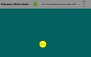
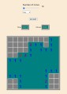

## Hi there! 👋

### My name is Dmitry and I'm Frontend Developer 🚀

#### Facts about me:
  - Proactive
  - English: C1
  - Love learning, programming and being creative

#### Contacts:  
[Telegram](https://t.me/m5production86)  
[E-mail](dimikh@mail.ru)

#### My skills:

#### Certificates:
[RS School Front-End](https://app.rs.school/certificate/yo4ro8ii)  
[Programming Fundamentals](https://stepik.org/cert/334114)

#### My projects:
[Clone-kahoot](https://dimetriyo.github.io/clone-kahoot/)

SPA on react with self-made backend (https://github.com/m5production/clone-kahoot-backend) hosted on Amvera, with Websocket, Shadcn, React-query, React-hook-form and Axios.

[E-commerce app](https://github.com/mamont79/eCommerce-Application)

SPA(single page application) on React made in a team of 3 with several pages and forms etc.  
**Stack**: React, Redux, React Router 6, Typescript, Vite, Formik, Axios, SPA, Husky, StyledComponents, Vitest, Git, HTML, CSS

[Pockemon memo game](https://github.com/m5production/pokemon-memo-game)

SPA(single page application) on React with animations  
**Stack**: React, Redux, Typescript, Vite, SPA, Git, HTML, CSS

[MineSweeper](https://github.com/m5production/Minesweeper)

SPA(single page application) on Vanilla TS with selfmade class-components  
**Stack**: JS, Webpack, SPA, Git, HTML, CSS
